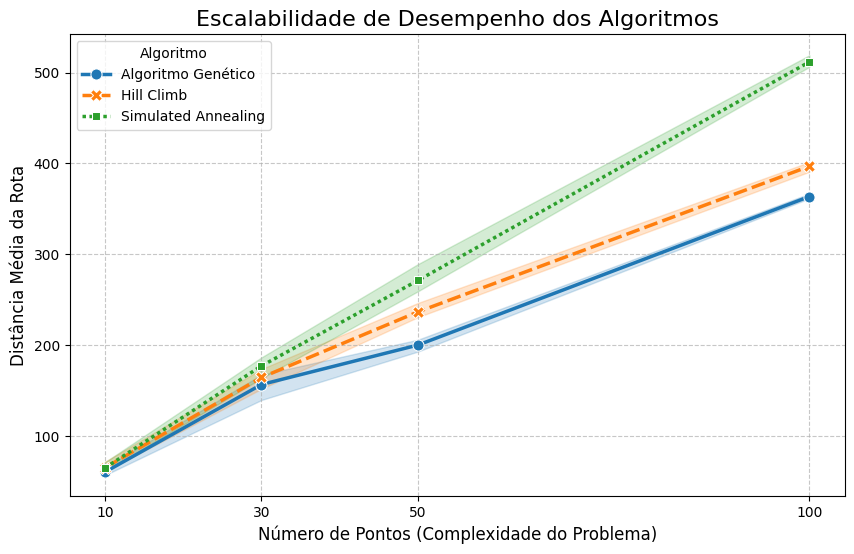
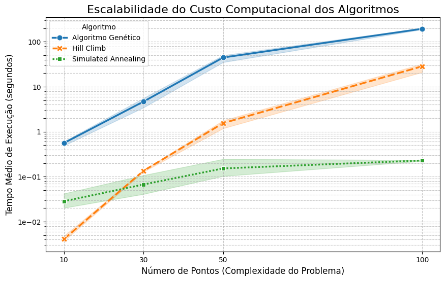

# Comparação de Algoritmos para Otimizacao de Rotas
*RESUMO*: Estudo analítico focado em engenharia de software para logística urbana, comparando a robustez e eficiência de três metaheurísticas (Algoritmo Genético, Simulated Annealing e Hill Climb) no Problema do Caixeiro Viajante Assimétrico (ATSP). O resultado provou que a consistência do Algoritmo Genético é a melhor abordagem para o cenário testado, para otimizar custos operacionais no mundo real, superando a velocidade do Simulated Annealing.

## 🎯 O Problema e a Metodologia
O desafio central foi replicar as restrições reais de uma cidade.

*Problema*: Resolver o ATSP, onde o sentido único das ruas e restrições de trânsito geram uma matriz de custos assimétrica.

*Dados*: Utilização de um grafo real da topologia de Bauru (SP), extraído via OSMnx e NetworkX, garantindo que as simulações sejam fiéis ao ambiente urbano.

*Função de Custo Híbrida (Inspirada em A*)*: Para refinar a busca, foi implementada uma função de custo que combina a distância real do grafo com a heurística geodésica (distância em linha reta). Este método funcionou como um GPS sofisticado, orientando a exploração e focando na precisão da rota.

## 📊 Resultados Chave (A Prova de Rigor)
O experimento foi validado estatisticamente com 100 execuções independentes por cenário de complexidade (até 100 pontos).

### 1. Superioridade e Consistência do Algoritmo Genético
O AG demonstrou a melhor qualidade média da solução em todos os cenários. Acima de 30 pontos, onde a probabilidade de encontrar a solução ótima cai para 1%, a consistência (baixo desvio padrão) do AG provou ser o fator decisivo para a logística.

### 2. O Achado: A Fragilidade do Simulated Annealing (SA)
Apesar de ser teoricamente superior ao Hill Climb, o SA demonstrou um comportamento atípico, degradando-se severamente em cenários complexos.

💡 *Tese Principal*: "A dependência do Simulated Annealing por calibração específica compromete sua robustez em topologias assimétricas complexas." O SA provou-se frágil quando configurado com parâmetros generalistas, limitando sua aplicação real.

### 3. Conclusão de Negócio (Implicação Prática)

"O Algoritmo Genético entrega a qualidade consistente, validando o investimento no tempo de execução para otimizar custos reais. A economia gerada por rotas até 150km mais curtas supera amplamente o custo marginal do cálculo."

## 📚 Material de Referência e Artigo Completo

Para uma análise metodológica completa, tabelas detalhadas e resultados estatísticos, acesse o trabalho na íntegra:

* **Artigo Completo (PDF):** [Acessar o TCC na Íntegra](https://drive.google.com/file/d/1LBX2M3xrpdxmTPk6f8zhXbY1zgJJmMJC/view?usp=sharing)